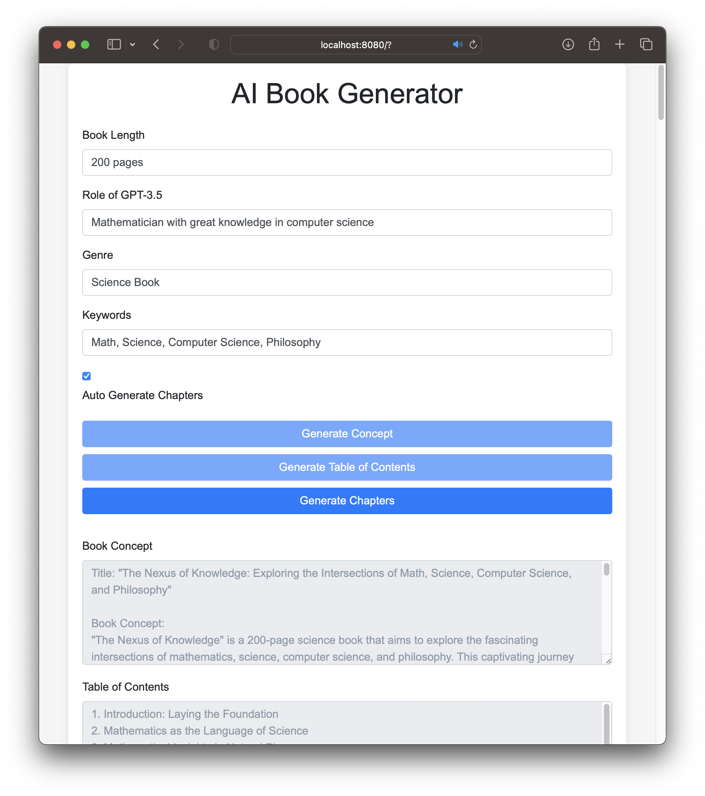

# 📚 AI Book Creator

AI Book Creator is a web application that allows you to generate complete books, from outline to final manuscript, using the power of Google's Gemini AI. You can define a theme, and the application will guide you through the process of creating a detailed plan, writing chapters, and generating final documents in DOCX and PDF formats.

## ✨ Features

-   **Interactive Web UI:** A user-friendly interface built with Gradio.
-   **Step-by-Step Book Creation:** Guides you through planning, chapter generation, and finalization.
-   **AI-Powered Content Generation:** Uses the Gemini API to generate outlines, summaries, titles, and chapter content.
-   **Customizable:** Allows you to choose the number of chapters, style, and other parameters.
-   **Multiple Output Formats:** Generates final documents in both DOCX and PDF.
-   **Project-Based:** Saves your progress automatically, allowing you to continue your work later.

## 🚀 Getting Started

Follow these instructions to set up and run the application in your local environment.

### Prerequisites

-   Python 3.7+
-   A Google Gemini API Key. You can get one from [Google AI Studio](https://aistudio.google.com/app/apikey).

### 1. Clone the Repository

```bash
git clone <repository_url>
cd <repository_directory>
```

### 2. Create a Virtual Environment (Recommended)

```bash
python -m venv venv
source venv/bin/activate  # On Windows, use `venv\Scripts\activate`
```

### 3. Install Dependencies

Install the required Python libraries using the provided `requirements.txt` file:

```bash
pip install -r requirements.txt
```

### 4. Configure the API Key

You need to set your Gemini API key as an environment variable.

**On macOS/Linux:**
```bash
export GEMINI_API_KEY="YOUR_API_KEY_HERE"
```

**On Windows (Command Prompt):**
```bash
set GEMINI_API_KEY="YOUR_API_KEY_HERE"
```
**On Windows (PowerShell):**
```powershell
$env:GEMINI_API_KEY="YOUR_API_KEY_HERE"
```

Replace `"YOUR_API_KEY_HERE"` with your actual Gemini API key.

### 5. Run the Application

Once the dependencies are installed and the API key is configured, you can run the application:

```bash
python app.py
```

This will start the Gradio web server. You will see a local URL in your terminal (usually `http://127.0.0.1:7860`). Open this URL in your web browser to use the application.

## Usage

1.  **Enter a Theme:** Start by entering the central theme or idea for your book in the "Etapa 1: Planejamento Inicial" section.
2.  **Start Planning:** Click the "Iniciar Planejamento" button. The AI will generate a suggested outline and a detailed summary.
3.  **Finalize the Plan:** Review the generated content. Choose a title from the suggestions (or write your own), and set the number of chapters and other options. Click "Finalizar Planejamento e Salvar".
4.  **Generate Chapters:** In "Etapa 2", click "Gerar Todos os Capítulos". The application will create each chapter sequentially, saving the progress as it goes. This may take a long time.
5.  **Finalize and Download:** Once the chapters are created, go to "Etapa 3" and click "Revisar Livro e Gerar Arquivos". The AI will perform a final review of the entire manuscript. After the review, download links for the DOCX and PDF files will appear.

---
*This application was developed and refactored by Jules, an AI Software Engineer.*

# AI Book Generator
kickstart your book writing process with AI (Proof of concept)

## Introduction
Welcome to the AI Book Generator, a tool to help kickstart your book writing process. The AI Book Generator is a fascinating blend of modern technologies, all revolving around AI. The most interesting aspect of this project is not only its ability to generate high-quality book content using OpenAI's GPT-3.5 language model, but also the fact that the [development and refinement of the project itself were guided by GPT-4](https://chat.openai.com/share/f790cb1e-ba47-42ad-a8f8-e09e9dc9dd04), another advanced model developed by OpenAI. This project truly showcases the potential of AI in creative processes and software development.

However, please bear in mind that this is a proof-of-concept project. It is meant to showcase what is possible and is not an exhaustive application. While the project is capable of generating book concepts, table of contents, and chapters, these outputs are only starting points. Like any other content sourced from the internet, the generated content should never be used without proper checking and refinement.

## Prerequisites
To get started with this tool, you will first need to acquire an [API key from OpenAI](https://platform.openai.com/account/api-keys). The API key is essential to interact with OpenAI's GPT-3.5 language model which powers the content generation part of this tool. 

To obtain an API key, you need to sign up on OpenAI's website and follow their guidelines. Once you have your API key, enter it in the script.js file in the appropriate place.

## Running the Application Locally
Once you have entered your API key, you can run the application on your local machine. For this, you need Python installed. If you have Python 2, navigate to the project directory in your terminal and run `python2 -m SimpleHTTPServer 8080`. If you are using Python 3, the command is `python3 -m http.server 8080`. This will start a local server and the website can be accessed by visiting `localhost:8080` in your web browser.



## Security
Please take utmost care of your OpenAI API key. It grants access to a paid service, and if it falls into the wrong hands, it can be misused. As a measure of caution, do not publish the script.js file with your API key on the internet. If you plan to contribute to this project or a similar one, remember to remove the API key before pushing your code to public repositories.

## Future Work
The AI Book Generator project is just the beginning and has immense potential for more advanced features and improvements. We hope this project inspires you to think about the possibilities of AI in literature, programming, and beyond. If you are an aspiring writer, an AI enthusiast, or both, we hope this tool provides you a starting point to explore the field further.

## Call for Contributions

This project, as it stands, is a simple and functional prototype demonstrating the power of OpenAI's GPT-3.5 model in the context of book creation. We are thrilled about the potential this tool has, and we're equally excited about making it more robust, feature-rich, and user-friendly. However, to make this vision a reality, we need your help!

We invite all enthusiastic developers, AI enthusiasts, and avid book readers to contribute to the project. There are several areas where we'd like to see improvements. For instance, features like session storage, better error handling, advanced content formatting, and performance optimization.

If you feel empowered to help us make this tool even better, please don't hesitate to submit a pull request or open an issue on GitHub. Let's make the magic of AI-driven book creation accessible to everyone!

